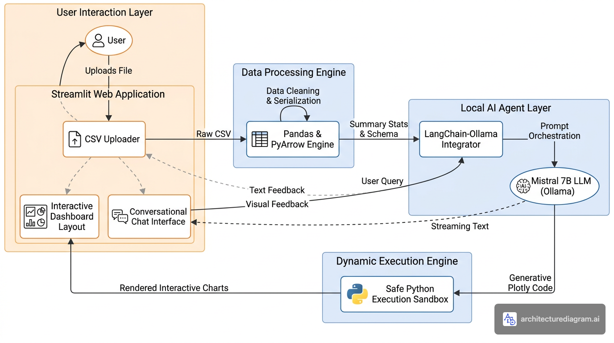

# 🤖 Agentic AI EDA Pipeline

<div align="center">


**An intelligent, fully automated Exploratory Data Analysis pipeline powered by a local AI agent.**  
Upload any CSV → Get a complete interactive dashboard + AI insights + conversational data Q&A.



</div>

---

## 🎯 What Is This Project?

This project is an **Agentic AI system** that automates the most time-consuming part of the data science workflow — Exploratory Data Analysis (EDA).

Instead of writing dozens of lines of Pandas and Matplotlib code every time you get a new dataset, you simply **upload your CSV file** and the agent automatically:

1. **Cleans & validates** the data (handles malformed headers, mixed types, serialization issues)
2. **Generates statistical summaries** (descriptive stats, missing values, data types)
3. **Produces AI-powered insights** using a locally running Mistral 7B LLM (via Ollama)
4. **Renders an interactive Power BI-style dashboard** with Plotly — automatically choosing the right charts based on your data's structure
5. **Answers your questions** about the dataset in a streaming conversational chat interface

---

## ✨ Key Features

| Feature | Description |
|---|---|
| 📁 **Universal CSV Support** | Handles any CSV — numerical, categorical, or mixed datasets |
| 🧹 **Auto Data Cleaning** | Detects malformed headers, fixes mixed-type columns, resolves PyArrow serialization issues |
| 📊 **Correlation Heatmap** | Interactive Plotly heatmap for numeric feature correlations |
| 📈 **Distribution Charts** | Histogram + embedded boxplot for every numeric column |
| 📊 **Categorical Breakdown** | Color-gradient bar charts for top category values |
| 🤖 **AI Agent Insights** | Mistral 7B LLM analyzes statistical summaries and generates human-readable insights |
| 💬 **Conversational Chat** | Ask questions about your data — streaming answers powered by LangChain + Ollama |
| 🔒 **100% Local & Private** | No data leaves your machine. All AI inference runs locally via Ollama |

---

## 🏗️ Architecture

The system follows a clean, layered agentic architecture:

```
User Upload (CSV)
       │
       ▼
┌─────────────────────┐
│  Pandas + PyArrow   │  ← Auto data cleaning & validation
│  Processing Engine  │
└─────────┬───────────┘
          │ Schema + Summary Stats (Metadata Injection)
          ▼
┌─────────────────────┐
│  LangChain-Ollama   │  ← Prompt orchestration
│  Integrator         │
└─────────┬───────────┘
          │ Text Insights + Streaming Q&A
          ▼
┌─────────────────────┐
│  Mistral 7B LLM     │  ← Runs 100% locally via Ollama
│  (Local Inference)  │
└─────────────────────┘
          │
          ▼
┌─────────────────────┐
│  Deterministic      │  ← Zero-error Plotly chart rendering
│  Plotly Dashboard   │  ← Pandas-driven chart type selection
└─────────┬───────────┘
          ▼
   Streamlit UI (Browser)
```

> **Key Design Decision — Metadata Injection**: Instead of sending raw CSV rows to the LLM (which would overflow its context window on large datasets), the app sends only the **schema (data types)** and **statistical summary (`df.describe()`)** — keeping prompts lightweight while preserving full analytical context.

> **Key Design Decision — Deterministic Rendering**: Visualizations are driven by strict Pandas column-type detection (not AI code generation), ensuring **zero rendering errors** regardless of dataset size or shape.

---

## 🛠️ Tech Stack

| Layer | Technology |
|---|---|
| **Frontend / UI** | [Streamlit](https://streamlit.io/) |
| **Data Processing** | [Pandas](https://pandas.pydata.org/), [NumPy](https://numpy.org/), [PyArrow](https://arrow.apache.org/docs/python/) |
| **Interactive Charts** | [Plotly Express](https://plotly.com/python/plotly-express/) |
| **AI Agent Orchestration** | [LangChain](https://python.langchain.com/) |
| **Local LLM Runtime** | [Ollama](https://ollama.com/) with `mistral` |

---

## 🚀 Getting Started

### Prerequisites

1. **Python 3.10+** installed on your machine
2. **[Ollama](https://ollama.com/)** installed and running locally
3. The **Mistral** model pulled in Ollama:

```bash
ollama pull mistral
```

> Ollama runs a local inference server on `http://localhost:11434`. No API keys or internet connection required for AI features.

### Installation

**1. Clone the repository**
```bash
git clone https://github.com/<your-username>/eda-agent.git
cd eda-agent
```

**2. Create and activate a virtual environment**
```bash
python3 -m venv .venv
source .venv/bin/activate        # macOS / Linux
# .venv\Scripts\activate         # Windows
```

**3. Install dependencies**
```bash
pip install -r requirements.txt
```

**4. Run the application**
```bash
streamlit run main.py
```

The app opens automatically at **`http://localhost:8501`**.

---

## 📖 Usage

1. **Upload** your CSV file using the file uploader
2. Click **"Generate EDA"** to trigger the full analysis pipeline
3. Explore:
   - **Dataset Overview** — row/column counts, missing value summary
   - **Statistical Parameters** — full `describe()` table
   - **AI Agent Insights** — LLM-generated patterns, issues & recommendations
   - **Interactive Dashboard** — Correlation heatmap, distributions, categorical breakdowns
4. Use the **Chat** box at the bottom to ask natural language questions about your data

---

## 📂 Project Structure

```
eda-agent/
├── main.py                  # Core Streamlit application
├── requirements.txt         # Python dependencies
├── architecture-diagram.png # System architecture diagram
├── .gitignore               # Git ignore rules
├── LICENSE                  # MIT License
└── README.md                # This file
```

---

## 🔒 Privacy & Security

- **All data stays local.** Your CSV files are never uploaded to any external server.
- **All AI inference is local.** The Mistral LLM runs entirely on your machine via Ollama.
- **No API keys needed.** Zero cloud dependencies for core functionality.

---

## 🤝 Contributing

Contributions, issues, and feature requests are welcome! Feel free to open an issue or submit a pull request.

---

## 📄 License

This project is licensed under the **MIT License** — see the [LICENSE](LICENSE) file for details.

---

<div align="center">
Built with ❤️ using Streamlit, LangChain, Plotly & Ollama
</div>
